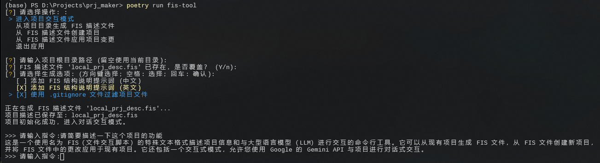

# FIS: File Interaction Script

<div>
   
   <a href="https://pypi.python.org/pypi/fis-tool">
      
   </a>
   <a href="https://jq.qq.com/?_wv=1027&k=71t9iCT7">
      
   </a>
</div>

## 简介

FIS (File Interaction Script) 是一种用于描述项目文件结构的文本格式，旨在简化与大型语言模型 (LLM) 的交互，实现更高效的项目迭代。它提供了一种结构化的方式，让您能够：

- **生成项目结构描述文件:** 从一个已存在的项目目录生成 FIS 描述文件，其中包含项目的完整文件结构和内容。
- **从 FIS 描述文件创建项目:** 使用 FIS 描述文件来创建一个新的项目，包含所有的文件和文件夹结构。
- **应用 FIS 描述文件中的变更:** 读取 FIS 文件中的变更描述，并应用到现有的项目中，包括添加、修改和删除文件。



## 功能

- **完全交互式终端:** 直接使用 `fis-tool` 命令启动交互式终端，所有功能均可在交互式环境中使用。
- **生成 FIS 描述文件:** 根据项目目录生成包含所有文件和文件夹结构的 FIS 描述文件。(用于向 LLM 提供多文件项目信息)
- **读取 FIS 描述文件:** 解析 FIS 描述文件内容，还原文件结构和内容信息。(用于从 LLM 的回复还原多文件项目结构)
- **应用 FIS 描述文件中的变更:** 读取 FIS 描述文件中的变更描述，并应用到现有的项目中，包括添加、修改和删除文件。(用于应用 LLM 进行的变更)
- **交互式项目操作:** 在您的项目进行交互式对话，方便快速获取思路和更改方案，并快速将变更应用到项目中。(需要 Gemini API 密钥)

## 规划中

- [ ] 支持连续对话
- [ ] 支持项目交互式应用更改
- [ ] 支持更多文件过滤或摘要方式
- [ ] 支持更多 Gemini 参数调整
- [ ] 支持更多 LLM (需要 LLM 支持足够长的上下文，因为项目 FIS 文件包含了大量文件内容信息)

## 使用方法

### 快速开始

```bash
# 1. 通过 pip 安装
pip install fis-tool --upgrade

# 2. 启动交互式终端，根据指引选择功能
fis-tool
```

### 交互式项目操作

FIS 工具提供了交互式项目操作模式，您可以通过对话的方式与工具进行交互，首先你需要获取一个 Gemini API 密钥。

1. **进入交互模式:** 直接使用 `fis-tool` 命令选择 "进入项目交互模式" 选项。
2. **初始化项目:** 根据 FIS 工具指引完成项目初始化，生成 FIS 文件。
3. **对话交互:** 输入您的指令，FIS 工具会根据 FIS 文件和您的指令与 Gemini 进行交互，并返回结果。
4. **应用变更:** FIS 工具会自动将对话中的变更应用到项目中，方便您快速调整和迭代。

### 命令行操作

1. **生成 FIS 描述文件:**
   - 使用 `fis-tool generate` 命令生成 FIS 描述文件。
   - 使用 `-o` 或 `--output` 参数指定输出文件路径。
   - 使用 `-e` 或 `--explanation` 参数选择添加 FIS 结构说明提示词（可选，默认不添加）。
   - 使用 `-g` 或 `--gitignore` 参数使用 `.gitignore` 文件忽略项目文件（可选，默认不使用）。
2. **从 FIS 描述文件创建项目:**
   - 使用 `fis-tool create` 命令从 FIS 描述文件创建项目。
   - 使用 `-f` 或 `--file` 参数指定 FIS 描述文件路径。
   - 使用 `-o` 或 `--output` 参数指定输出项目路径。
3. **应用 FIS 描述文件中的变更:**
   - 使用 `fis-tool apply` 命令将 FIS 描述文件中的变更应用到项目。
   - 使用 `-p` 或 `--project` 参数指定项目根目录路径。
   - 使用 `-f` 或 `--file` 参数指定 FIS 描述文件路径。

### 命令示例

```bash
# 生成 FIS 描述文件
fis-tool generate -p my_project -o my_project.fis -e zh -g

# 从 FIS 描述文件创建项目
fis-tool create -f my_project.fis -o new_project

# 应用 FIS 描述文件中的变更
fis-tool apply -p my_project -f changes.fis
```

### 注意事项

1. Gemini 代理问题

由于 Gemini 官方库没有提供设置代理的功能，如果需要使用代理访问，需要手动修改官方库代码

修改文件位置: `(你的运行 Python 环境)\Lib\site-packages\google\ai\generativelanguage_v1beta\services\generative_service\transports\grpc.py` (117 行)

```python
options=[
   ("grpc.max_send_message_length", -1),
   ("grpc.max_receive_message_length", -1),
   ("grpc.http_proxy", "http://127.0.0.1:7890"),   # 增加这一行，按需要设置为你的代理地址
],
```
